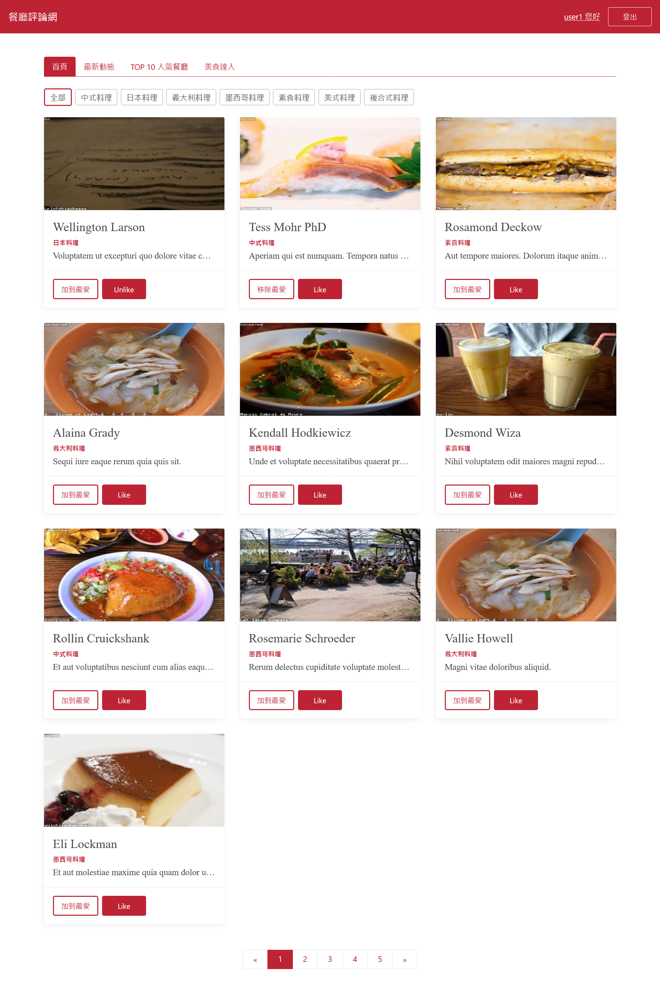

# Restaurant-forum-front-end
A restaurant forum built with Vue.js



## User Features
- Restaurants:
  - View all restaurants, or filter by category and/or page
  - View specific restaurant's details
  - Favorite/Unfavorite any restaurant 
  - Like/Unlike any restaurant
  - Leave a comment on any restaurant
- Users:
  - View all top users
  - View specific user profile
  - Favorite/Unfavorite other users
  - Like/Unlike other users
  - Follow/Unfollow other users
  - Edit your name and profile picture
## Admin Features
- Has all the privileges as general users (e.g. view all restaurants)
- Can delete any comments
- Access to the backstage:
  - Add a new restaurant
  - View or edit a restaurant's details
  - Delete a restaurant
  - Add/Edit/Delete a category
  - Assign any members as admin or user
## Setup project locally
### Prerequisite
- Node.js v14.16.0
- MySQL v8.0.15

### 1. Clone this repository
```
git clone https://github.com/querlemtle/restaurant-forum-front-end.git
```

### 2. Navigate into the project directory
```
cd restaurant-forum-front-end
```

### 3. Install all dependencies
```
npm install
```

### 4. Setup local backend server
```
cd forum-express
```

### 4-1. Install all dependencies
```
npm install
```

### 4-2. Setup database in MySQL
```
CREATE DATABASE forum;
```

### 4-3. Generate seed data
```
npx sequelize db:migrate
npx sequelize db:seed:all
```

### 4-4. Start the server
```
npm run dev
```

### 5. Compiles and hot-reloads for front-end development
```
npm run serve
```

### 6. Compiles and minifies for front-end production
```
npm run build
```

### 7. Lints and fixes files
```
npm run lint
```

### Customize configuration
See [Configuration Reference](https://cli.vuejs.org/config/).
